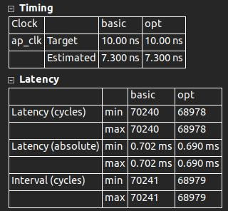
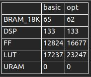

# tinyFPS
use FPGA to accelerate the Farthest Point Sampling operation

# what is FPS

Farthest Point Sampling  is a important operation using in PointCloud Sampling. For a PointCloud P, this operation downsample a small pointset S.

# Why we accelerate the FPS

FPS is a normal operation for PointCloud. In recent study, we find this operation has long running  time. 

e.g.

| num_point | num_sample |CPU(ms) |NVIDIA 1080Ti runtime(ms)|
| :-: | :-: |:-:| :-:|
|1024 | 32 | 4.862| 0.178|
| 1024 | 64 | 7.259|0.227|
| 1024 | 128|11.010|0.422|
| 1024 | 256 | 18.134|0.719| 

# How to accelerate

we will design a parallel architecture to excute it more efficiently by data reuse and overlapping the transformation and calculation stage, and using the Xilinx HLS tool to implement this architecture.

# HLS

use Vitis_hls 2020.1, Compared to the Intel CPU, we achieves on 7.04x speedup when the 1024 points sample 32 points

## solution

there are two solution: 'basic' and 'opt', the 'basic' solution has no directive, and in 'opt' solution, we try to optimize the bottleneck by use 'ARRAY_PARTITION', 'UNROLL', 'PIPELINE' directive, and get a little optimization.

the Performance Estimates:

the Utilization Estimates:

